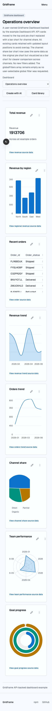
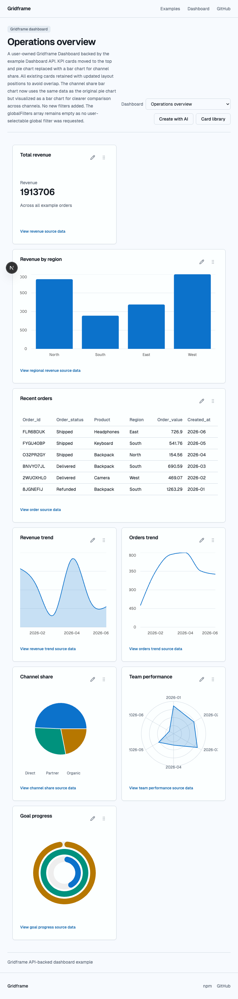
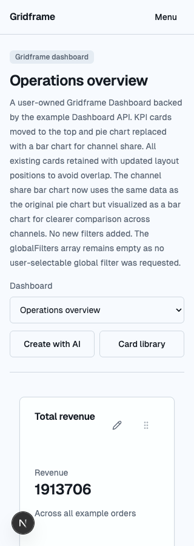
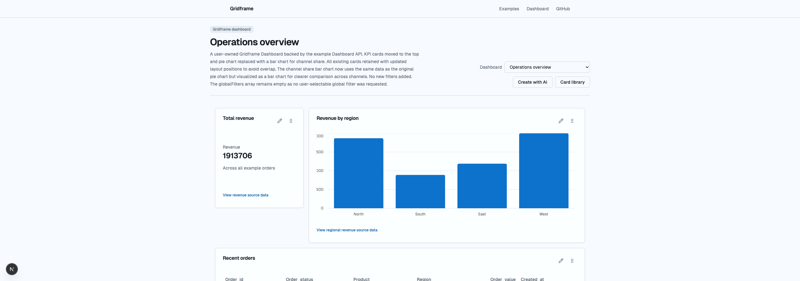

# Responsiveness Check: Example dashboard

**URL**: `http://localhost:3000/gridframe/users/example-user/dashboards/e6ef1cbb-07f2-4056-b754-14c1ab7d7cbd`

**Date**: 2026-07-26

**Mode**: Standard, post-implementation verification

**Breakpoints tested**: 320, 375, 768, 1024, 1280, 1440, 1920, 2560px

**Viewport height**: 900px

**Browser tool**: Chromium via Playwright 1.58.2

## Summary

| Width | Status | Issues |
| --- | --- | --- |
| 320px | Pass | — |
| 375px | Pass | — |
| 768px | Pass | — |
| 1024px | Pass | — |
| 1280px | Pass | — |
| 1440px | Pass | — |
| 1920px | Pass | — |
| 2560px | Warn | 1 low |

**Overall**: The requested responsive changes are implemented and verified. Phone Cards stack at full width, tablet Cards use a two-column presentation, and desktop restores the persisted four-column geometry. The browser run found no clipped text, undersized phone targets, document-level horizontal overflow, console errors, or page errors.

## Implemented Changes

### Responsive Card layout

- Phone container widths below 640px use a one-column presentation.
- Tablet container widths from 640px through 959px use two presentation columns.
- Desktop container widths from 960px upward use the canonical persisted four-column layout.
- Phone Cards measured 256px wide in a 320px viewport and 311px wide in a 375px viewport.
- At 768px, the metric Card measured 336px and the three-column regional chart expanded to the full 688px content width.
- At 1024px, the original desktop geometry returned: 220px for the one-column metric Card and 692px for the three-column chart.

The phone and tablet arrangements are derived from the canonical layout. Drag and resize are disabled while a derived layout is active. A focused browser check resized a single session through phone, tablet, and desktop modes and observed zero layout `PATCH` requests.

### Mobile controls

- Mobile button variants now provide a 44px minimum height.
- Card edit and drag controls use 44×44px mobile hit areas.
- Card deeplinks have a 44px minimum mobile height.
- The Dashboard selector and primary actions are 44px high on phones.
- Global-filter inputs/actions and retry controls have 44px mobile hit areas.
- Drill-down navigation and retry controls have 44px mobile hit areas.
- Site header and footer links have 44px mobile hit areas.

The automated phone checks found zero interactive targets smaller than 44px at both 320px and 375px.

### Metric typography

Metric values now use container-relative `clamp()` sizing and can wrap at word boundaries instead of being forcibly truncated. This complements the wider tablet span and keeps unusually long values readable when a Card is constrained.

### Dashboard selector

The Dashboard label now stacks above a full-width selector on phones. The Create with AI and Card library actions use an even two-column row and remain above the fold.

### Compact site navigation

The desktop navigation is replaced by a compact Menu control below 640px. The native disclosure menu exposes Examples, Dashboard, and GitHub as 44px-high links. The focused browser check opened the menu and verified all three links were visible.

## Transition Analysis

| Transition | Observed at | Clean? | Notes |
| --- | --- | --- | --- |
| Site navigation: compact menu → full links | 640px CSS breakpoint | Yes | No wordmark collision at 320px. |
| Dashboard Cards: 1 column → 2 columns | Between tested 375px and 768px | Yes | Driven by a 640px Dashboard container width. |
| Dashboard Cards: 2 columns → persisted 4 columns | Between tested 768px and 1024px | Yes | Driven by a 960px Dashboard container width. |
| Dashboard header: stacked → side-by-side | 768px CSS breakpoint | Yes | Description and toolbar remain separated. |
| Dashboard content reaches maximum width | 1280px | Yes | Card dimensions stop growing and remain centred. |

## Remaining Low-Severity Finding

### Dashboard uses only half of an ultra-wide viewport — Low

**Width**: 2560px

**Check**: Whitespace balance

The dashboard still caps at 1280px, leaving 640px margins on each side. This was not included in the requested implementation recommendations. Containment keeps line lengths and charts readable, but a data-dense Dashboard could optionally use more of the available canvas.

## Verification

- Eight-width standard responsive check completed in one Chromium session.
- Compact mobile Menu opened and exposed all navigation links.
- Phone mode: one column, 256px Card width at a 320px viewport.
- Tablet mode: two columns.
- Desktop mode: four persisted columns restored at 1024px.
- Viewport resizing produced zero layout `PATCH` requests.
- No page errors or console errors.
- No document-level horizontal scrollbar at any tested width.
- No clipped text at any tested width.
- No undersized interactive targets at 320px or 375px.

All screenshots and raw measurements are in [`docs/responsiveness-screenshots/2026-07-26`](responsiveness-screenshots/2026-07-26/). The machine-readable measurements are in [`example-dashboard-results.json`](responsiveness-screenshots/2026-07-26/example-dashboard-results.json).
